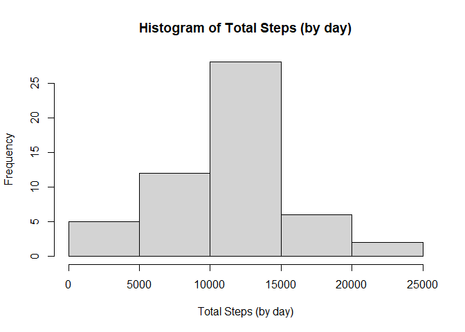
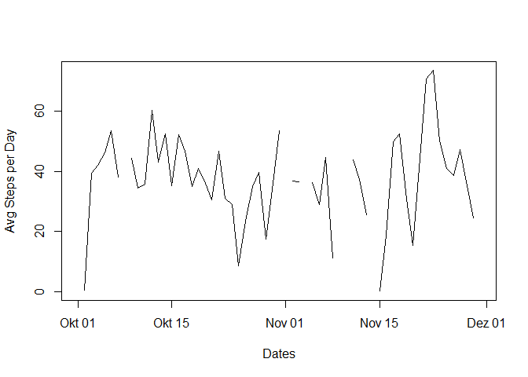
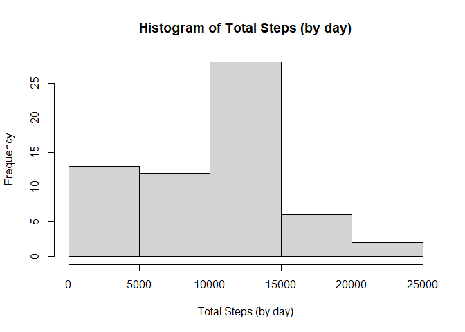
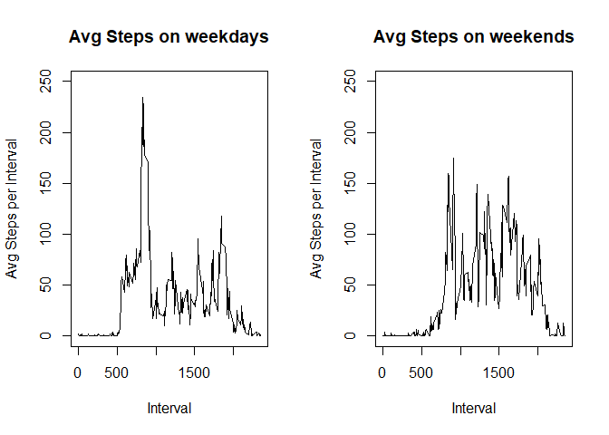

## Load Librarys


```r
library(dplyr)
```

```
## 
## Attaching package: 'dplyr'
```

```
## The following objects are masked from 'package:stats':
## 
##     filter, lag
```

```
## The following objects are masked from 'package:base':
## 
##     intersect, setdiff, setequal, union
```

## 1. Code for reading in the dataset and/or processing the data
### Load Data
data is expected to be in the same folder than the markdown file


```r
activity_data <- read.csv('activity.csv', sep=",")
```

### Preprocess data 
convert the columns into numeric values and convert Date String to Date Values


```r
activity_data$steps <- as.numeric(activity_data$steps)
activity_data$interval <- as.numeric(activity_data$interval)
activity_data$date <- as.Date(activity_data$date,"%Y-%m-%d")
```


## 2.Histogram of the total number of steps taken each day


```r
activity_data_grouped <- activity_data %>% group_by(date) 
total_step_by_day<-summarize(activity_data_grouped,total_steps = sum(steps))
```

```
## `summarise()` ungrouping output (override with `.groups` argument)
```

```r
hist(total_step_by_day$total_steps, xlab = "Total Steps (by day)", main = "Histogram of Total Steps (by day)")
```

<!-- -->


## 3. Mean and median number of steps taken each day

```r
x <- mean(total_step_by_day$total_steps, na.rm = TRUE)
y <- median(total_step_by_day$total_steps, na.rm = TRUE)

sprintf("The mean number of steps by day: %.4f ",x)
```

```
## [1] "The mean number of steps by day: 10766.1887 "
```

```r
sprintf("The median number of steps by day: %i ",y)
```

```
## [1] "The median number of steps by day: 10765 "
```

## 4. Time series plot of the average number of steps taken


```r
avg_steps_by_day<-summarize(activity_data_grouped,avg_steps = mean(steps,na.rm = TRUE))
```

```
## `summarise()` ungrouping output (override with `.groups` argument)
```

```r
avg_steps_by_day$date <- as.Date(avg_steps_by_day$date,"%Y-%m-%d")

plot(x = avg_steps_by_day$date, 
     y=avg_steps_by_day$avg_steps, 
     type="l",
     xlab = "Dates",
     ylab = "Avg Steps per Day",
     xlim = c(as.Date("2012-10-01","%Y-%m-%d"),as.Date("2012-11-30","%Y-%m-%d"))
     )
```

<!-- -->

## 5. The 5-minute interval that, on average, contains the maximum number of steps


```r
activity_data_grouped_interval <- activity_data %>% group_by(interval)
avg_steps_by_interval<-summarize(activity_data_grouped_interval,avg_steps = mean(steps,na.rm = TRUE))
```

```
## `summarise()` ungrouping output (override with `.groups` argument)
```

```r
m <- avg_steps_by_interval %>% top_n(1,avg_steps)

sprintf("The interval with the highest avg steps is %i",m$interval)
```

```
## [1] "The interval with the highest avg steps is 835"
```
## 6. Code to describe and show a strategy for imputing missing data
Having intervals with NAs could be interpreted as having interval with zero steps, so I replace all NA Values for steps with zeros

```r
activity_data_imputed = activity_data
activity_data_imputed$steps[is.na(activity_data_imputed$steps)] = 0
```

## 7. Histogram of the total number of steps taken each day after missing values are imputed

```r
activity_data_imputed_grouped <- activity_data_imputed %>% group_by(date) 
total_step_by_day_imputed<-summarize(activity_data_imputed_grouped,total_steps = sum(steps))
```

```
## `summarise()` ungrouping output (override with `.groups` argument)
```

```r
hist(total_step_by_day_imputed$total_steps, xlab = "Total Steps (by day)", main = "Histogram of Total Steps (by day)")
```

<!-- -->

## 8. Panel plot comparing the average number of steps taken per 5-minute interval across weekdays and weekends

```r
data_weekday <- activity_data[as.POSIXlt(activity_data$date)$wday > 0 &  as.POSIXlt(activity_data$date)$wday <6,]
data_weekend <-activity_data[as.POSIXlt(activity_data$date)$wday == 0 | as.POSIXlt(activity_data$date)$wday == 6,]

weekday_avg_steps_per_interval <- data_weekday %>% group_by(interval) %>% summarize(avg_steps = mean(steps,na.rm = TRUE))
```

```
## `summarise()` ungrouping output (override with `.groups` argument)
```

```r
weekend_avg_steps_per_interval <- data_weekend %>% group_by(interval) %>% summarize(avg_steps = mean(steps,na.rm = TRUE))
```

```
## `summarise()` ungrouping output (override with `.groups` argument)
```

```r
par(mfrow=c(1,2))

plot(x = weekday_avg_steps_per_interval$interval,
     y = weekday_avg_steps_per_interval$avg_steps,
     type="l",
     xlab = "Interval",
     ylab = "Avg Steps per Interval",
     main = "Avg Steps on weekdays",
     ylim = c(0,250)
     )

plot(x = weekend_avg_steps_per_interval$interval,
     y = weekend_avg_steps_per_interval$avg_steps,
     type="l",
     xlab = "Interval",
     ylab = "Avg Steps per Interval",
     main = "Avg Steps on weekends",
     ylim = c(0,250)
     )
```

<!-- -->
